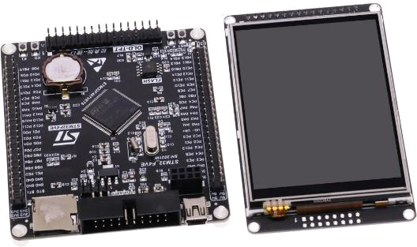
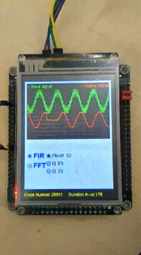

X-CUBE-DSPDEMO on the STM32F407VET6 "blackboard"
==================================================

This is a port of the original X-CUBE-DSPDEMO project (can be found on the
[ST.com](https://www.st.com/en/embedded-software/x-cube-dspdemo.html)) on the
popular low cost STM32F407VET6 "blackboard", which is equipped with the ILI9341
LED display and the TSC2046 (HR2046 clone) touch screen:

BSP-wise original discovery and chineese "blackboard" are different, so only
BSP/Components/ili9341 driver was taken which was significantly changed.

"Middlewares" folder was renamed to "Middleware" because stupid STM32CubeMX
has a bug which deletes the folder.

The Drivers/CMSIS was taken from the STM32CubeF4 project (can be found on
[github.com](https://github.com/STMicroelectronics/STM32CubeF4))

I prefer sources from the github (rather than tarball), seems more up-to-date
and easy to track changes, so the whole CMSIS was copied from the STM32CubeF4
project.

This port differes from the original ST version of the X-CUBE-DSPDEMO as
follows:

* BSP for the ILI9341 LED display, FSMC bus
* BSP for the TSC2046 (HR2046 clone) touch screen, SPI interface
* Periphery (ADC, DAC, GPIO, RTC, SPI, FSMC, Clocks) configuration using
  the STM32CubeMX, so that project can be regenerated each time
* Refactoring of the FFT processing, DAC and ADC conversion
* Makefile tweaks, which enables DSP support (ARM_MATH_CM4 defines) and
  adds additional sources and includes

### In action

